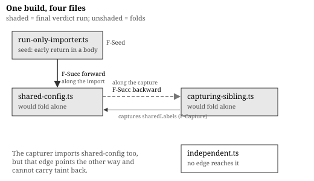

# The mechanism

Draft for #53. Every claim names the rule that states it; `spec/` is the long form and this is a guide to it.

## Two layers of admissibility

A file is admitted in two stages, and the first is easy to miss because it is not about expressions at all.

The **statement gate** (`S-Module`) examines only exported statements, and recognises six shapes.

| Shape | Example |
|---|---|
| a construction bound to a `const` | `export const b = new Bucket({…})` |
| any other `const` initializer | `export const web = Stack({…})` |
| a destructured export | `export const { a, b } = Stack({…})` |
| a local export list | `export { a, b }` |
| a re-export | `export { a } from "./m"` |
| an exported function | `export function f() {…}` |

Six further shapes disqualify the whole file (`S-Disqualify`). A default export and a star re-export are two of them; an exported class is a third. Non-exported statements are invisible to the gate, neither admitted nor disqualifying, and they never execute.

The gate's granularity is the design decision rather than the list. It is per module, and the justification is that an unreducible export can reference, or be referenced by, a reducible one in ways only running proves safe. A per-declaration gate would have to decide whether a half-reduced namespace is coherent, and it is not (`F-Total`).

The gate is per module rather than per declaration, and the reason is worth stating: an unfoldable export can reference or be referenced by a foldable one in ways only running proves safe (`F-Total`).

The **expression classifier** (`grammar.md` §2) then decides the shapes inside an admitted statement. It resolves nothing. That is deliberate, and it is the subject of the direction claim below.


## What reduction produces

The value domain and the three mechanisms by which reduction reaches a value have their own section. Two facts from it are needed here. Reduction produces envelopes that denote what the source named, of which exactly one kind survives to serialisation (`F-Val-Fate`). And the guarantee is narrow: none of the reduced file's own statements execute, while revival does import and invoke the module the fallback path would have imported (`F-NoOwnExecution`).

## Two sub-grammars, and an asymmetry

Two statement-level grammars govern what may appear inside a function the reducer evaluates, and both are narrower than the module gate.

A **project-local function** is admissible when its parameters bind plainly and its body is a single expression, or `const` declarations followed by one `return` (`S-FnBody`). No generator, no `async`, no early return, no `let`. A block with no `return` evaluates to `undefined`.

A **composite factory** is admissible under the same shape with one difference: its body must end in `return`, and an empty body is refused (`S-FactoryBody`).

The two disagree on exactly that point, and the specification says so rather than harmonising them. Inside a function body, five constructs that reduce at a file's top level are refused (`F-Eval-New` and its siblings at depth).

- a construction
- a tagged template
- a helper call
- an intrinsic call
- the `.step` idiom Each would produce an envelope revived against the *caller's* imports, which is not the scope the body was written in. Admissibility is therefore not a property of a construct alone but of a construct in a position.

## One classifier, two consumers, one permitted direction

The subset has a single definition with two consumers. A lint pass reads it without a binding resolver or a registry; an evaluator reads it with both. They will disagree, and the specification's job is to constrain how.

The claim is one-directional and stated with its exceptions inside it. **If evaluation succeeds, classification accepts** (`F-Direction`), except in two cases. The classifier is flow-insensitive, so it requires every branch of a short-circuiting operator to be admissible where the evaluator reduces only the taken one (`F-Exc-Lazy`); `false && f()` is therefore a lint error on source that reduces cleanly. And the classifier takes the intrinsic registry as an optional parameter, so without one a call form the registry would admit is refused (`F-Exc-Registry`).

The direction is chosen rather than observed, and the reason is asymmetric cost. A classifier that accepts too much produces a fallback the author learns about from a per-file decision line. A classifier that rejects too much produces an error on correct source, and a lint that cries wolf gets disabled, taking the real diagnostics with it. The classifier is also the predicate a downstream tool asks *will this reduce* without running a reduction, and such a tool must get an answer safe to act on.

Twelve enumerated divergences run the permitted way (`F-Div-*`). Half of them, as a sample.

| Rule | Classifier sees | Evaluator additionally requires |
|---|---|---|
| `F-Div-Ident` | any bare identifier | that it resolves |
| `F-Div-Tag` | any tagged-template tag | that the registry admits it |
| `F-Div-Provenance` | a registered helper name | that the name was imported from the host |
| `F-Div-SpreadType` | a spread operand of valid shape | that it reduces to an object or an array |
| `F-Div-Nullish` | a member read | that the object is not nullish, unless written `?.` |
| `F-Div-Step` | any call narrowed to `.step` | that the callee is unclaimed |

Each costs coverage rather than correctness, because a file the classifier passes and the evaluator refuses falls back to run. That asymmetry is what makes the direction the safe one to guarantee: a classifier that erred the other way would report errors on correct source, and a lint that cries wolf gets switched off.

## The per-file verdict

Evaluating a single file yields either a reduction with a complete export namespace, or a fallback with a located reason (`F-Total`, `F-Reason`). Three properties of that verdict matter downstream.

**It is total per file.** One unrecognised export disqualifies the whole module. There is no partial namespace, which is what lets a referring file treat another file's result as either wholly available or wholly absent.

**It is reported.** A fallback is a normal outcome rather than an error, and that is exactly why it must appear: an unreported fallback is indistinguishable from a reduction, and the no-execution guarantee becomes unauditable (`F-Obs-Report`). The reason is located, naming the construct and its position; a failure inside a called function is re-anchored at the call site, with the callee's own position carried in the message (`F-Reason`).

**It is parameterised by isolation.** Under an isolated mode, a reduction that would have to invoke project-owned code falls back instead (`F-IsolatedRefusal`). The verdict is therefore not a pure function of the source, and a specification that omitted the parameter would describe a judgment that behaves differently in any real deployment.

All of this is still a proposal. What makes a verdict final is the fixpoint.

## Identity across the boundary

Per-file partial evaluation is unsound when values have identity, and this is the part with no precedent we could find.

Suppose file `A` reduces and file `B` falls back, and both refer to an entity that `A` produced. `B`'s real import of `A` constructs a second copy, and the build now holds two objects for one entity.

That is not an abstract hazard, and the failure it produces is specific. Each entity is assigned a logical name when the build collects it, and attribute references carry a weak reference to the entity they belong to. Only one of two copies is collected. The other's attribute references then reach an entity with no logical name, and serialisation fails outright. Where it does not fail, a reference that should point at the collected entity inlines the uncollected one's value instead, leaving output that is quietly wrong rather than absent. Both were observed before the rule was written.

Every comparable system avoids the problem by not having it. Compile-time function execution copies values across its boundary, so nothing at run time shares identity with a compile-time object. Per-page static rendering shares no runtime objects between a prerendered page and a served one. A whole-program partial evaluator has a single heap, and preserving sharing within one heap is the easy case. Only a per-unit decision over a shared object graph has the problem at all, which is why the fixpoint has no precedent we found rather than a better-known equivalent.

The fixpoint (`F-Taint`) closes the tentative verdicts under two edges:

- **forward**, along imports: a running file taints what it imports, because its real import would construct what a folded copy already holds (`F-Succ`);
- **backward**, along captures: a file whose objects were captured taints the capturer, because the instance the capturer holds is no longer the one the build collects (`F-Succ`, `F-Capture`).

A third edge runs through calls rather than imports: a project-local function whose call returns a live object the body produced records the same capture (`F-CallLeak`). Invocation propagates identity the same way import does.

Seeded with every file that would not fold alone, closed under both edges, least fixpoint over a finite set, so it terminates (`F-Fix`). Two supporting rules make it meaningful: each file is evaluated at most once per build (`F-Memo`), and within a file a call reached through several member accesses is invoked exactly once (`F-Count`). Without those, a capture would record an edge to a copy.

The property this buys is stated and argued in `theorem.md`: exactly one object represents each entity, and every reference resolves to it.

Two consequences are worth stating because they look like defects:

**A leaf fix buys nothing while an importer still falls back.** Making a leaf reducible changes no verdict until every file in the closure above it also reduces. This was observed as coverage *falling* after a migration that made a widely imported file reducible, which read as a regression and was the rule working. An implementation that optimised it away would reintroduce the two-objects problem directly.

**A file's verdict is not a property of its own source.** Through the backward edge, a file that reduces cleanly can be forced back because something else captured one of its objects and then fell back. Nothing in the first file predicts that, which places a real obligation on reporting: the reason must be able to say that a file fell back because another did and captured from it.

## A worked example



The fixpoint is easiest to read on a build made to exercise it. The production implementation ships one: four files whose verdicts its own test asserts by name, measured here by running its build with per-file decisions reported.

```
shared-config.ts     export const sharedLabels = { … }        -- a plain object, has identity
                     export const sharedConfig = new ConfigMap({ labels: sharedLabels })

run-only-importer.ts import { sharedLabels } from "./shared-config"
                     function tier(n) { if (n > 1) return "ha"; return "single" }
                     export const x = new ConfigMap({ labels: sharedLabels, data: { tier: tier(2) } })

capturing-sibling.ts import { sharedLabels } from "./shared-config"
                     export const y = new ConfigMap({ labels: sharedLabels })

independent.ts       const localLabels = { … }                -- same VALUE, no shared identity
                     export const z = new ConfigMap({ labels: localLabels })
```

Tentative verdicts first, each file judged alone (J2). `run-only-importer.ts` fails. `tier` has an early return that `S-FnBody` excludes, so the call cannot reduce, and one failed declarator disqualifies the file (`F-Total`). The other three succeed. Two of them capture `sharedLabels`, a non-primitive, so the capture set records them against `shared-config.ts` (`F-Capture`).

Now the fixpoint (`F-Taint`):

1. Seed: `{ run-only-importer.ts }`, the one file that failed on its own (`F-Seed`).
2. Forward edge: the seed imports `shared-config.ts`, so that file is tainted (`F-Succ`). Nothing about it resists reduction, and running it anyway is the point. Reduced independently, its objects would be rebuilt by the importer's real import, leaving two objects claiming to be one entity.
3. Backward edge: `capturing-sibling.ts` reduced cleanly and captured `sharedLabels` from a file that now runs, so the object it holds is not the object the build will collect, and the reverse edge taints it (`F-Succ`, via `F-Capture`).
4. Closure: nothing reaches `independent.ts`. It imports no sibling and captures nothing; its labels are the same *value* as the shared ones and deliberately not the same *object*, because the edge is identity and not equality.

Three files run and one folds. Note which edge does the third step. `capturing-sibling.ts` also imports `shared-config.ts`, and that forward edge points from importer to imported, so it cannot carry taint back. Only the capture edge can, and without it the file would reduce while its source runs.

The control file is what makes the example an example. Without it, "taint forced those three to run" is indistinguishable from "this build does not reduce".

**One gap the example exposes.** The production implementation reports the same fallback reason for steps 2 and 3: *would fold in isolation, but a file that imports it falls back to run*. Nothing imports `capturing-sibling.ts`. The reason is accurate for the forward edge and false for the backward one, and `F-Obs-Report` requires an implementation to be able to say that a file ran because another file ran and captured from it. This is recorded as a defect rather than smoothed over, because a verdict no file's own source predicts is exactly the one whose explanation has to be right.

## What a host supplies

The subset is parameterised. A host provides six things (`F-Host-Interface`). Two concern entities, being the constructors that build them and how they expose attributes. Three are lists the host installs, an intrinsic registry and an authoring-helper allowlist and a trust set. The sixth is the form a composite registration takes. A registered call is admitted only if it is a pure function of its arguments and invoking it at fold time is indistinguishable from invoking it during a real run (`F-Host-Admission`), and revival always invokes the function the file imported rather than a reimplementation (`F-Host-NoSubstitution`).

The interesting rule is an asymmetry between two kinds of callee. Into a **package**, reduction goes only through a closed allowlist, checked by name *and* by the provenance of the binding, so a helper of the author's own that happens to share a registered name is not the host's and the file falls back (`F-Div-Provenance`). Into a **project file**, reduction proceeds whenever the callee's body is itself in the subset, with no allowlist at all.

That looks backwards until the trust boundary is stated. Package code is already loaded and executed by the build before reduction begins, to obtain the serialisers and lint rules the build cannot run without; admitting a call into it costs no execution the process was not already performing, so it is admitted by declaration and verified by registration. Project code is the untrusted input, and it is admitted only when it can be *evaluated without being executed*, which a syntactic check of the callee's body decides and an allowlist could not.

Admission to the allowlist has its own bar. A registered call must be a pure function of its arguments, and calling it during reduction must be indistinguishable from calling it during a real run (`F-Host-Admission`). Revival then uses the function the file imported rather than a reimplementation (`F-Host-NoSubstitution`), which is the principle compile-time function execution states: context decides where a function runs and never what it means.

The generality this buys is over host vocabularies, not over languages. The syntax is TypeScript's and the operator semantics are ECMAScript's, with two deliberate departures the specification names (`R10.2`, `R10.6` in `grammar.md`'s rationale).
