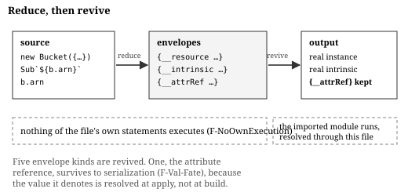

# The mechanism

Draft for #53. Every claim names the rule that states it; `spec/` is the long form and this is a guide to it.

## Two layers of admissibility

A file is admitted in two stages, and the first is easy to miss because it is not about expressions at all.

The **statement gate** (`S-Module`) examines only exported statements, and recognises six shapes.

| Shape | Example |
|---|---|
| a construction bound to a `const` | `export const b = new Bucket({…})` |
| any other `const` initializer | `export const web = Stack({…})` |
| a destructured export | `export const { a, b } = Stack({…})` |
| a local export list | `export { a, b }` |
| a re-export | `export { a } from "./m"` |
| an exported function | `export function f() {…}` |

Anything else disqualifies the whole file, `S-Disqualify` listing the cases. Non-exported statements are invisible to the gate. They are neither admitted nor disqualifying, and they never execute.

The gate is per module rather than per declaration, and the reason is worth stating: an unfoldable export can reference or be referenced by a foldable one in ways only running proves safe (`F-Total`).

The **expression classifier** (`grammar.md` §2) then decides the shapes inside an admitted statement. It resolves nothing. That is deliberate, and it is the subject of the direction claim below.

## Three evaluation modes

Reducing an expression to a value uses three different mechanisms, and conflating them is the easiest way to misread the design.



**Envelope, then revive.** The common case. Evaluation produces a symbolic envelope naming what the source named: `{__resource}` for a construction, `{__intrinsic}` for a registered intrinsic, `{__helper}` for an authoring helper, `{__compositeStep}` for the `.step` idiom (`F-Val-Domain`). Nothing executes. A second phase then resolves each name **through the folding file's own imports** and invokes the real constructor or function (`F-Val-Fate`). The value the caller receives is the one the run path would have produced, from the same module the source itself imported.

That two-phase shape is what makes the no-execution claim precise. What is guaranteed is that none of the folded file's own statements run (`F-NoOwnExecution`). Revival does run code — the same code the run path would import for the same purpose. Stating the claim as "nothing executes" would be false; omitting revival would make the specification unimplementable.

**Interpret, without importing.** A composite factory defined in the project's own source, registered in a form the host recognises, and whose body stays inside a narrower statement subset, is *evaluated* rather than invoked (`F-Call` step 4, `F-Host-Composite`). Its defining module is never imported. This is the mode that lets a file fold under isolation at all, and it has no counterpart in the envelope path.

**Evaluate eagerly.** A registered function whose result is coerced to a string during folding is called at fold time rather than enveloped, because an envelope deferred to revival would stringify as a placeholder (`F-Eval-CallEager`). A method call on a real receiver is the same mode (`F-Eval-CallMethod`). Both run code the file imported rather than code it wrote.

## The value domain

Reduction produces a value from a closed domain (`F-Val-Domain`). Six of its cases are ordinary JSON. The rest are **envelopes**, non-array objects carrying one marker key, each denoting something the build has not yet constructed (`F-Val-Envelope`).

| Envelope | Denotes | Fate |
|---|---|---|
| `__attrRef` | an attribute of another entity, resolved at apply | survives to serialisation |
| `__intrinsic` | a registered intrinsic, in tag or call form | revived |
| `__helper` | a call to a registered authoring helper | revived |
| `__resource` | a construction, top level or nested as a value | revived |
| `__compositeStep` | the `.step` idiom | revived |
| `__symbol` | source text kept inside an intrinsic's interior | revived |

Three properties of that domain are easy to state wrongly.

**An envelope is a finished value, not a thunk.** An `__attrRef` is the same shape the runtime object serialises to. Describing these as unevaluated invites an implementation that tries to force them, and there is nothing to force: the value they denote does not exist at build time on either path (`F-Val-Envelope`).

**Exactly one envelope reaches a serialiser.** Revival replaces the other five (`F-Val-Fate`). An implementation that emitted a `__resource` envelope has produced wrong output, not a placeholder.

**Validity is position-dependent.** Inside the arguments of an intrinsic or a helper an `__attrRef` is refused rather than passed (`F-Val-Position`). The receiving function inspects what it is given, and a look-alike plain object produces wrong output rather than absent output. The same value is valid one position out. A specification of the domain alone does not capture this, so the rule is part of the domain.

Callables sit outside the domain entirely. One may be *called* during reduction and is never a value, so `{ resolver: f }` does not reduce though `f(x)` does (`F-Val-Callable`).

## Two sub-grammars, and an asymmetry

Two statement-level grammars govern what may appear inside a function the reducer evaluates, and both are narrower than the module gate.

A **project-local function** is admissible when its parameters bind plainly and its body is a single expression, or `const` declarations followed by one `return` (`S-FnBody`). No generator, no `async`, no early return, no `let`. A block with no `return` evaluates to `undefined`.

A **composite factory** is admissible under the same shape with one difference: its body must end in `return`, and an empty body is refused (`S-FactoryBody`).

The two disagree on exactly that point, and the specification says so rather than harmonising them. Inside a function body, five constructs that reduce at a file's top level are refused (`F-Eval-New` and its siblings at depth).

- a construction
- a tagged template
- a helper call
- an intrinsic call
- the `.step` idiom Each would produce an envelope revived against the *caller's* imports, which is not the scope the body was written in. Admissibility is therefore not a property of a construct alone but of a construct in a position.

## One classifier, two consumers, one permitted direction

The subset has a single definition with two consumers. A lint pass reads it without a binding resolver or a registry; an evaluator reads it with both. They will disagree, and the specification's job is to constrain how.

**If evaluation succeeds, classification accepts** (`F-Direction`), with two named exceptions. The classifier is flow-insensitive, so it requires every branch of a short-circuiting operator to be valid where the evaluator folds only the taken one (`F-Exc-Lazy`). And it takes the intrinsic registry as an optional parameter: without one, a call form the registry would admit is refused (`F-Exc-Registry`).

Twelve enumerated divergences run the permitted way (`F-Div-*`). Half of them, as a sample.

| Rule | Classifier sees | Evaluator additionally requires |
|---|---|---|
| `F-Div-Ident` | any bare identifier | that it resolves |
| `F-Div-Tag` | any tagged-template tag | that the registry admits it |
| `F-Div-Provenance` | a registered helper name | that the name was imported from the host |
| `F-Div-SpreadType` | a spread operand of valid shape | that it reduces to an object or an array |
| `F-Div-Nullish` | a member read | that the object is not nullish, unless written `?.` |
| `F-Div-Step` | any call narrowed to `.step` | that the callee is unclaimed |

Each costs coverage rather than correctness, because a file the classifier passes and the evaluator refuses falls back to run. That asymmetry is what makes the direction the safe one to guarantee: a classifier that erred the other way would report errors on correct source, and a lint that cries wolf gets switched off.

## The per-file verdict

Evaluation of a single file yields `fold` with a complete export namespace, or `run` with a located reason (`F-Total`, `F-Reason`). The result is all or nothing, because one unrecognised export disqualifies the file. A fallback is a normal outcome, not an error, which is why it must be reported — an unreported fallback is indistinguishable from a fold, and the no-execution guarantee becomes unauditable (`F-Obs-Report`).

The verdict is parameterised by isolation. Under an isolated mode, a fold that would have to invoke project-owned code falls back instead (`F-IsolatedRefusal`), so the decision is not a pure function of the source.

This verdict is a proposal. What makes it final is the fixpoint.

## Identity across the boundary

Per-file partial evaluation is unsound when values have identity, and this is the part with no precedent we could find.

Suppose file `A` folds and file `B` runs, and both refer to an entity that `A` produced. `B`'s real import of `A` constructs a second copy, and the build holds two objects for one entity: their attribute references cannot both receive a logical name, and a reference to one silently inlines instead of referring. Every comparable system avoids this by not having it. Compile-time function execution copies values across its boundary; per-page static rendering shares no runtime objects; a whole-program partial evaluator has one heap.

The fixpoint (`F-Taint`) closes the tentative verdicts under two edges:

- **forward**, along imports: a running file taints what it imports, because its real import would construct what a folded copy already holds (`F-Succ`);
- **backward**, along captures: a file whose objects were captured taints the capturer, because the instance the capturer holds is no longer the one the build collects (`F-Succ`, `F-Capture`).

A third edge runs through calls rather than imports: a project-local function whose call returns a live object the body produced records the same capture (`F-CallLeak`). Invocation propagates identity the same way import does.

Seeded with every file that would not fold alone, closed under both edges, least fixpoint over a finite set, so it terminates (`F-Fix`). Two supporting rules make it meaningful: each file is evaluated at most once per build (`F-Memo`), and within a file a call reached through several member accesses is invoked exactly once (`F-Count`). Without those, a capture would record an edge to a copy.

The property this buys is stated and argued in `theorem.md`: exactly one object represents each entity, and every reference resolves to it.

Two consequences are worth stating because they look like defects:

- A leaf fix buys nothing while an importer still runs. This was observed as falling coverage before it was understood, and it is the soundness condition rather than a bug.
- A folded file can be forced to run by a file it never imports, through the backward edge. Nothing in its own source predicts that, which is why the fallback reason has to be able to say so.

## A worked example


The fixpoint is easiest to read on a build made to exercise it. The production implementation ships one: four files whose verdicts its own test asserts by name, measured here by running its build with per-file decisions reported.

```
shared-config.ts     export const sharedLabels = { … }        -- a plain object, has identity
                     export const sharedConfig = new ConfigMap({ labels: sharedLabels })

run-only-importer.ts import { sharedLabels } from "./shared-config"
                     function tier(n) { if (n > 1) return "ha"; return "single" }
                     export const x = new ConfigMap({ labels: sharedLabels, data: { tier: tier(2) } })

capturing-sibling.ts import { sharedLabels } from "./shared-config"
                     export const y = new ConfigMap({ labels: sharedLabels })

independent.ts       const localLabels = { … }                -- same VALUE, no shared identity
                     export const z = new ConfigMap({ labels: localLabels })
```

Tentative verdicts first, each file judged alone (J2). `run-only-importer.ts` fails. `tier` has an early return that `S-FnBody` excludes, so the call cannot reduce, and one failed declarator disqualifies the file (`F-Total`). The other three succeed. Two of them capture `sharedLabels`, a non-primitive, so the capture set records them against `shared-config.ts` (`F-Capture`).

Now the fixpoint (`F-Taint`):

1. Seed: `{ run-only-importer.ts }`, the one file that failed on its own (`F-Seed`).
2. Forward edge: the seed imports `shared-config.ts`, so that file is tainted (`F-Succ`). Nothing about it resists reduction, and running it anyway is the point. Reduced independently, its objects would be rebuilt by the importer's real import, leaving two objects claiming to be one entity.
3. Backward edge: `capturing-sibling.ts` reduced cleanly and captured `sharedLabels` from a file that now runs, so the object it holds is not the object the build will collect, and the reverse edge taints it (`F-Succ`, via `F-Capture`).
4. Closure: nothing reaches `independent.ts`. It imports no sibling and captures nothing; its labels are the same *value* as the shared ones and deliberately not the same *object*, because the edge is identity and not equality.

Three files run and one folds. Note which edge does the third step. `capturing-sibling.ts` also imports `shared-config.ts`, and that forward edge points from importer to imported, so it cannot carry taint back. Only the capture edge can, and without it the file would reduce while its source runs.

The control file is what makes the example an example. Without it, "taint forced those three to run" is indistinguishable from "this build does not reduce".

**One gap the example exposes.** The production implementation reports the same fallback reason for steps 2 and 3: *would fold in isolation, but a file that imports it falls back to run*. Nothing imports `capturing-sibling.ts`. The reason is accurate for the forward edge and false for the backward one, and `F-Obs-Report` requires an implementation to be able to say that a file ran because another file ran and captured from it. This is recorded as a defect rather than smoothed over, because a verdict no file's own source predicts is exactly the one whose explanation has to be right.

## What a host supplies

The subset is parameterised. A host provides six things (`F-Host-Interface`). Two concern entities, being the constructors that build them and how they expose attributes. Three are lists the host installs, an intrinsic registry and an authoring-helper allowlist and a trust set. The sixth is the form a composite registration takes. A registered call is admitted only if it is a pure function of its arguments and invoking it at fold time is indistinguishable from invoking it during a real run (`F-Host-Admission`), and revival always invokes the function the file imported rather than a reimplementation (`F-Host-NoSubstitution`).

Calls into a package fold only through a closed allowlist checked by name and import provenance; calls into the project's own files fold whenever the callee's body is itself in the subset. The asymmetry is the trust boundary: package code is already loaded and executed by the build, while project code is the untrusted input and is admitted only when it can be evaluated without being executed.

The generality this buys is over host vocabularies, not over languages. The syntax is TypeScript's and the operator semantics are ECMAScript's, with two deliberate departures the specification names (`R10.2`, `R10.6` in `grammar.md`'s rationale).
